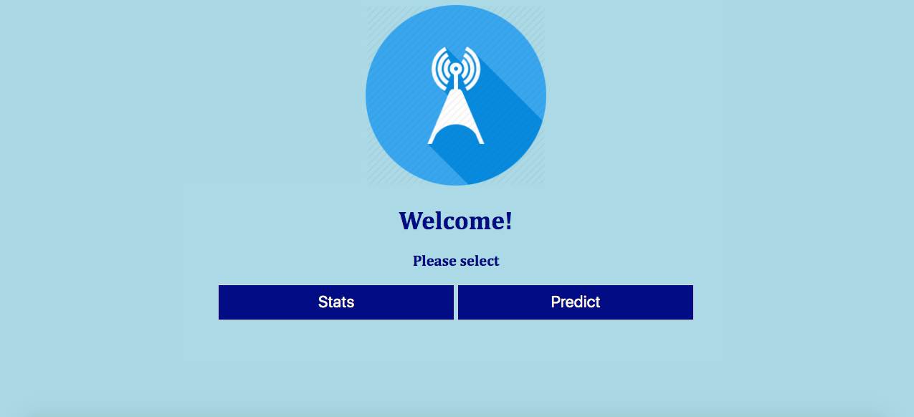
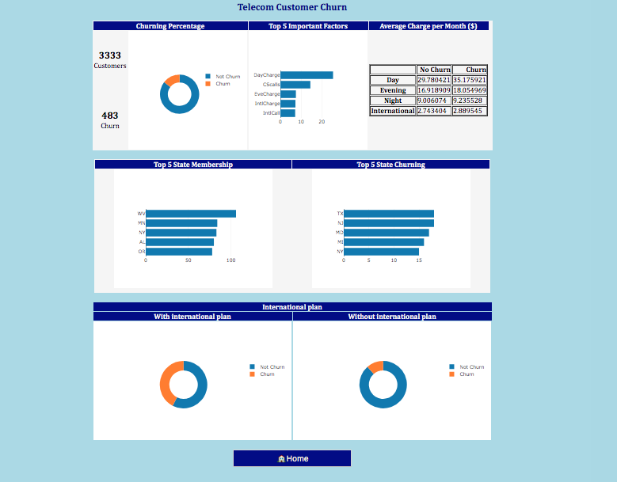
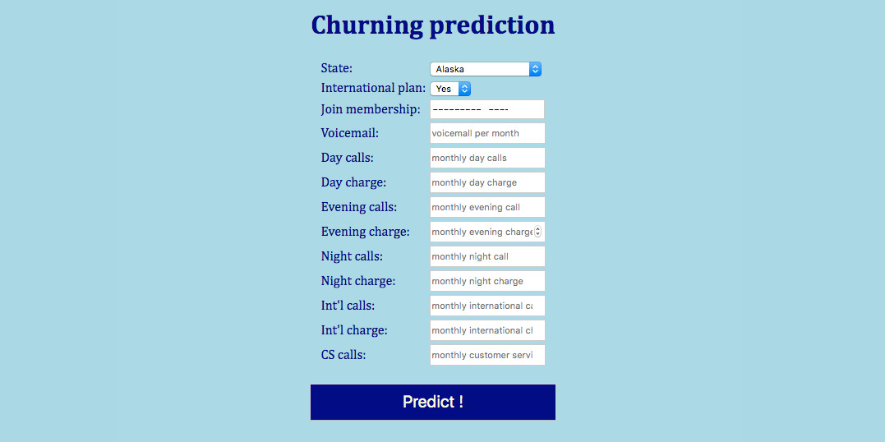
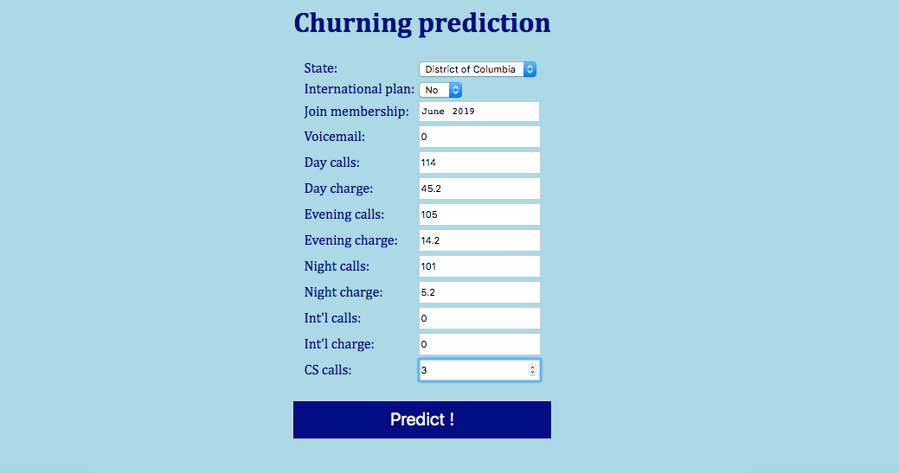
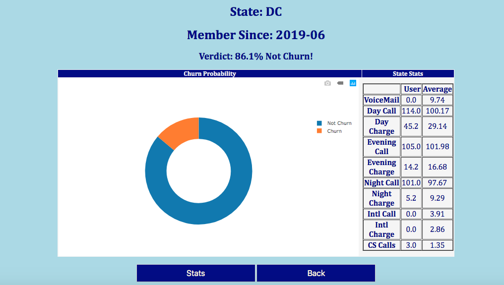

# JCDS 07 Final Project

# Telecom Customer Churning Classification

#### By: Christian Elbert

What is churning? Churning is the rate at which customers stop doing business with an entity.
  
Customer churning is a major issue for many businesses, telecom industry being no exception. This issue then will lead to company's financial loss and even reputation wise.

There are many factors that contribute to churning in telecom industry, including customer service issue, product issue or competitors. Having the ability to predict churn will give company a better idea in forecasting future revenue.

With the above in mind, I will attempt to make a machine learning model to identify this issue. The outcome desired is to determine factors affecting churn, make recommendation based on findings and predict churning outcome given user input. 

The dataset used for this project is __["Telecom Churning"](https://www.kaggle.com/mnassrib/telecom-churn-datasets)__ provided by __["Kaggle"](https://www.kaggle.com/)__.

In this web application, 4 html pages will be shown.

1. Home  
    This is the first page shown when accessing web apps. In this page, you can choose between two options, Stats (view current statistics) and Predict (user will input data to make prediction).

    

2. Stats  
    After user clicked Stats, user will be shown current statistics from the company. This includes current churning rate, average charges and subscription's top 5 state.

    

3. Predict  
    This page will show which data can be used to make prediction. Data that will be used to make prediction includes monthly charges, customer service calls made, date join and US' state. 
    
    Data inputted then will be used to predict churning through machine learning model. 

    
    

4. Churn  
    This is the final page that will show prediction result. In this page, user can see the churning probabilty percentage, visualize in a graph and table comparing user's information to the average in a particular US' state.

    

#### Christian Elbert _christian_elbert96@yahoo.com_
[Github](https://github.com/christianelbert) | [LinkedIn](https://www.linkedin.com/in/christian-elbert-a45008b9/)

